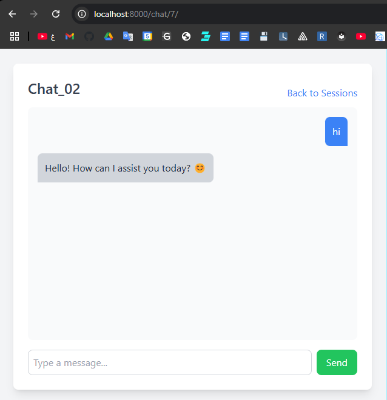
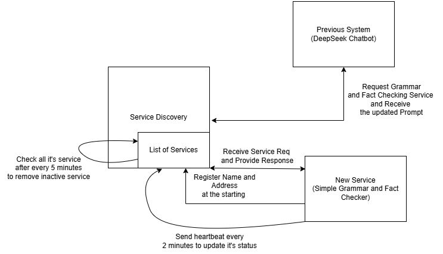

# LLM Project Studio

Welcome to the LLM Project Studio! This is a Django-based project that integrates with Ollama. The project is containerized using Docker for easy deployment.

## Prerequisites
Before running the project, ensure you have the following installed:
- **Python 3.8.10**
- **pip** (Python package manager)
- **Docker** (for containerized deployment)
- **Ollama** (for the AI interaction)

ensure:
- **Ollama is running on your machine** (`http://localhost:11434`)

<br>

## Running the Project Locally

#### 1️⃣ Clone the Repository
```sh
git clone https://github.com/Hasan-Saju/LLM-Project-Studio
cd LLM-Project-Studio
```

#### 2️⃣ Create a Virtual Environment
```sh
python -m venv venv
source venv/bin/activate   # For macOS/Linux
venv\Scripts\activate     # For Windows
```

#### 3️⃣ Install Dependencies
```sh
pip install -r requirements.txt
```

#### 4️⃣ Run Migrations
```sh
cd llm_project
python manage.py makemigrations
python manage.py migrate
```

#### 5️⃣ Start the Django Server
```sh
python manage.py runserver
```
- The application will be available at **http://127.0.0.1:8000/**


<br>

## Running the Project with Docker

#### 1️⃣ Build the Docker Image
```sh
docker build -t my-django-app .
```

#### 2️⃣ Run the Container
```sh
docker run -p 8000:8000 my-django-app
```
- The application will be accessible at **http://localhost:8000/**


<br>


## Environment Variables
To configure **Ollama API URL**, create a `.env` file in the `llm_project` directory with:
```env
ENVIRONMENT=development  # or 'production'
# Ollama API URL
OLLAMA_API_DEV=http://localhost:11434
OLLAMA_API_PROD=http://host.docker.internal:11434  
```

<br>

## Preview



## Preview



# Service Registry - Microservices Discovery and Communication

## Overview

The **Service Registry** is a microservice that allows dynamic discovery, registration, and communication between different microservices in a distributed architecture. It enables microservices to register themselves, send heartbeats to indicate their availability, and communicate with each other.

## Features

- **Service Registration:** Microservices register themselves with the registry upon startup.
- **Heartbeat Monitoring:** Services send a heartbeat every 2 minutes to indicate they are alive.
- **Service Discovery:** Any service can request a list of available services.
- **Message Forwarding:** Allows a service to send a message to another service.
- **Auto Deregistration:** If a service fails to send a heartbeat within 5 minutes, it is removed from the registry.

## Technologies Used

- **Python** (Flask for the Service Registry, Requests for HTTP communication)
- **Django** (For the chatbot and grammar correction service)
- **Threading** (For background monitoring of inactive services)

## Running the Service Registry

Run the service registry to allow microservices to register:

```bash
python service_registrar.py
```

## API Endpoints

### 1. Register a Service

Registers a new microservice with the registry.

- **Endpoint:** `POST /register`
- **Request Body:**
  ```json
  {
    "service_name": "grammar_service",
    "service_address": "http://localhost:5002/process"
  }
  ```
- **Response:**
  ```json
  {"message": "Service grammar_service registered successfully"}
  ```

### 2. List All Services

Returns a list of active microservices.

- **Endpoint:** `GET /list`
- **Response:**
  ```json
  {
    "grammar_service": "http://localhost:5002/process"
  }
  ```

### 3. Send Heartbeat

Updates the last seen time of a service to prevent deregistration.

- **Endpoint:** `POST /heartbeat`
- **Request Body:**
  ```json
  {"service_name": "grammar_service"}
  ```
- **Response:**
  ```json
  {"message": "Heartbeat received from grammar_service"}
  ```

### 4. Forward a Message to Another Service

Allows one service to send a request to another registered service.

- **Endpoint:** `POST /forward`
- **Request Body:**
  ```json
  {
    "target_service": "grammar_service",
    "payload": {"message": "r u fine"}
  }
  ```
- **Response:**
  ```json
  {"fixed_message": "are you fine"}
  ```

## Service Cleanup Process

- A **background thread** runs every 60 seconds to check for inactive services.
- If a service does not send a heartbeat for **5 minutes**, it is automatically removed.

## Communication Between Chatbot and Service Registry

The **Chatbot** interacts with the **Service Registry** to send messages to other microservices like the Grammar Service. The chatbot follows these steps:

1. **Fetch Available Services:** The chatbot queries the service registry to get the list of available services.
2. **Forward Messages:** The chatbot forwards user messages to the appropriate microservice (e.g., Grammar Service) via the service registry.
3. **Receive Processed Response:** The registry forwards the processed response back to the chatbot.

### **Chatbot Requesting Available Services**

- **Endpoint:** `GET /microservices/list/`
- **Chatbot Request:**
  ```python
  response = requests.get("http://localhost:5001/list")
  available_services = response.json()
  ```
- **Example Response:**
  ```json
  {
    "grammar_service": "http://localhost:5002/process"
  }
  ```

### **Chatbot Forwarding a Message to a Registered Service**

- **Endpoint:** `POST /microservices/forward/`
- **Chatbot Request:**
  ```python
  response = requests.post("http://localhost:5001/forward", json={
      "target_service": "grammar_service",
      "payload": {"message": "r u fine"}
  })
  fixed_message = response.json()["fixed_message"]
  ```
- **Example Response:**
  ```json
  {"fixed_message": "are you fine"}
  ```

## Running Other Services

### Running the Grammar Service

```bash
python grammar_service.py
```

### Running the Django Chatbot

```bash
python manage.py runserver
```


## Conclusion

The **Service Registry** ensures seamless communication between microservices by dynamically managing service discovery and request forwarding. This setup makes our chatbot system scalable and resilient.
